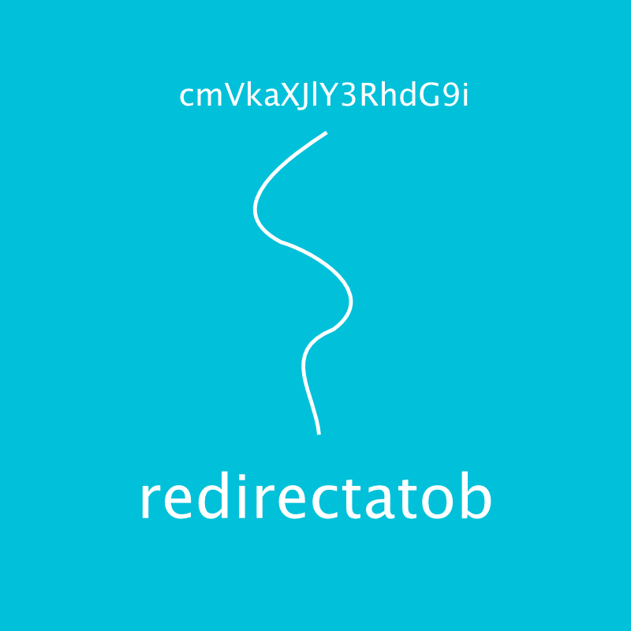

##### Redirections encoded with btoa

Maybe it'll help if you think of them instead of redirect`atob`s. Basically redirectatob is a webpage that you pass a URL to in the location hash (i.e. domain/page.html#hash, but encoded with btoa. The webpage will convert the encoded hash back into a URL using atob through the client's JavaScript. I made it so that I could give this URL - http://www.woodus.com/den/games/dq4ds/mugshots.php - to a friend of mine. The site's blacklist was preventing me from posting the link, and, as it had happened to me multiple times before, I decided I needed to make a redirect service.

I don't own a server, though, so just using the client's `btoa`/`atob` worked.
